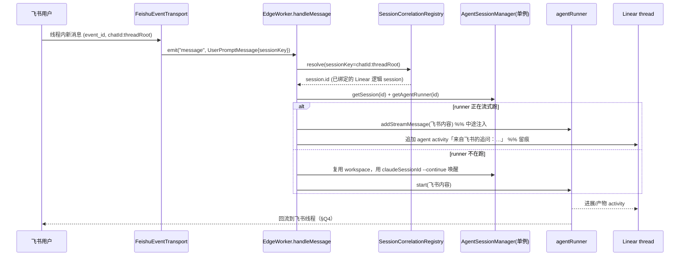

# 统一 Session · 多 Channel 输入方案（设计文档）

> Linear: [IN-42](https://linear.app/principle-intl/issue/IN-42) · 状态：**调研 + 出方案（先不落实现代码）**
> 目标：把「飞书线程」与「Linear Agent Session」看成**同一个逻辑 Session 的两个外部输入 Channel**，任一渠道的用户消息都能注入同一个进行中的 Session。

本文所有 `file:line` 引用均基于本仓库当前 `main`（worktree `IN-42`）实际代码复核，非臆测。

---

## 0. TL;DR（结论先行）

- **类型层已经渠道无关**，问题在**存储层分裂**和**入口层分裂**，不在 `CyrusAgentSession` 本身。
- 已经存在的 `InternalMessage` 总线（`packages/core/src/messages/*`）+ `EdgeWorker.handleMessage()` 是「多 channel 进一个 session」的**天然统一入口**，但除 `handleIssueStateChangeMessage` 外**全是 TODO 空占位**，真正干活仍走各渠道 legacy `event` 链路。
- 推荐方案：**不新造 Session 抽象**，而是（a）把飞书/Slack 聊天会话从各 `ChatSessionHandler` 私有的内存态 `AgentSessionManager` 收敛到 EdgeWorker 单例 `agentSessionManager` + 持久化；（b）建立**双向 correlation 映射**（飞书 threadKey ↔ Linear session.id）；（c）逐步激活 `InternalMessage` 总线作为统一注入入口；（d）把「完成通知」泛化成「过程回流」。
- 全程可**分阶段、可回滚**，每阶段都以 legacy 链路为 fallback。

---

## 1. 现状复核（逐条核对 issue 的「现状」，纠正偏差）

### 1.1 共享的 Session 类型，分裂的存储 —— ✅ 属实，但有关键纠正

- `CyrusAgentSession` 定义在 `packages/core/src/CyrusAgentSession.ts:70-107`。**类型层面它已经基本渠道无关**：没有 Linear/飞书/Slack 专有字段，渠道身份靠 `issueContext.trackerId`（泛型字符串 `"linear"`/`"github"`/…，`CyrusAgentSession.ts:27-34`）与 `externalSessionId?`（`:74`，只有 Linear 会设）承载。运行期 runner 挂在 `agentRunner?: IAgentRunner`（`:97`，不可序列化）。
  - **纠正 1**：`type`/`context` 被硬编码为 `AgentSessionType.CommentThread`（`:75,:77`），且 `CyrusAgentSessionEntry` 仍残留一个渠道命名的泄漏字段 `linearAgentActivityId?`（`:114`）。即「类型层几乎渠道无关，但仍带一处 Linear 命名的历史包袱」。

- **Linear 会话存储**：EdgeWorker 单例 `private agentSessionManager: AgentSessionManager`（字段 `EdgeWorker.ts:222`，构造 `:502-533`）。
  - **纠正 2（重要）**：`AgentSessionManager` **不在 `core`，在 `packages/edge-worker/src/AgentSessionManager.ts`**。其内部是纯内存 `Map`：`sessions`（`:71`）、`entries`（`:72`）。
  - **纠正 3（重要）**：持久化方法名不是 `serializeMappings`，而是 `AgentSessionManager.serializeState()`（`:1670-1692`）与 `restoreState()`（`:1697-1727`）。`serializeState` 会 **strip `agentRunner`**（`:1680` 解构丢弃），只输出 `{sessions, entries}`；`activitySinks`、任务/工具缓冲、`messageProcessingQueues` 等运行期状态一律不序列化。`EdgeWorker.serializeMappings()`（`EdgeWorker.ts:7256-7278`）是**上层聚合器**——它调用 `agentSessionManager.serializeState()`（`:7258`）等，再交给 `PersistenceManager.saveEdgeWorkerState()`（`:7244`）落盘。

- **跨仓库 `GlobalSessionRegistry`**：`packages/edge-worker/src/GlobalSessionRegistry.ts:53-337`。
  - **纠正 4（重要）**：它虽然实现了完整的 session/entry 存储 API，但**当前几乎是「死代码」**——EdgeWorker 只用到它的 `getParentSessionId`/`setParentSession`/`serializeState().childToParentMap`（`EdgeWorker.ts:508,:6307,:6326,:7261,:7327`）。`createSession`/`updateSession`/`addEntry`/`restoreState` 从未被调用。**真正的 session 存储仍全在 `AgentSessionManager`**；`GlobalSessionRegistry` 今天只承担「child→parent map」。这一点对本方案很重要：它正是「统一 Session 存储」最自然的落点。

- **持久化文件 `~/.cyrus/state/edge-worker-state.json`**：读写在 `packages/core/src/PersistenceManager.ts`。
  - 路径 `getEdgeWorkerStateFilePath()`（`:146-148`），默认 `~/.cyrus/state`（`:138-139`）。
  - 写 `saveEdgeWorkerState()`（`:160-174`），读 `loadEdgeWorkerState()`（`:180-231`），`PERSISTENCE_VERSION = "4.0"`（`:15`，含 v2→v3→v4 迁移）。
  - 落盘 shape `SerializableEdgeWorkerState`（`:99-115`）：`agentSessions`、`agentSessionEntries`、`childToParentAgentSession`、`issueRepositoryCache`、`feishuIssueNotifications`、`feishuCreatedIssueRunners`。

### 1.2 聊天渠道适配器已成型 —— ✅ 属实

- `ChatPlatformAdapter` 接口 `ChatSessionHandler.ts:47`；实现 `FeishuChatAdapter`（`FeishuChatAdapter.ts:80`）/ `SlackChatAdapter`（`SlackChatAdapter.ts:44`）。
- 飞书线程身份 = `${chatId}:${threadRoot}`（`FeishuChatAdapter.getThreadKey` `:362-364`）+ alias keys（`getThreadAliasKeys` `:381-386`，候选 `chatId:threadId`/`chatId:rootId`/`chatId:messageId`）。归并逻辑 `ChatSessionHandler.resolveThreadSession`（`:647-664`）/`registerThreadAliases`（`:672-678`），两张表 `threadSessions`（`:178`，canonical 1:1）+ `threadAliases`（`:185`，别名）。
- 同渠道追问注入：`ChatSessionHandler.handleEvent` `:236` 起。runner 正跑且支持流式 → `runner.addStreamMessage(taskInstructions)`（`:314`）；不支持中途注入 → `queuePendingFollowup`（`:322`）+ `notifyBusy`（`:323`）；runner 不在跑 → `resumeSession(... --continue)`（`:340-356`）。`pendingFollowups`（`:213`）在一个 `result` 后由 `drainPendingFollowups`（`:686-704`）以新 turn 重放。

### 1.3 统一消息总线已搭好但未接管 —— ✅ 完全属实（这是核心接缝）

- `InternalMessage` 联合类型 `packages/core/src/messages/types.ts:426-432`，判别字段 `action`（`:27-33`）；基类 `InternalMessageBase`（`:65-87`）带 **`sessionKey`**（`:80`，Linear=`agentSession.id`、GitHub=`owner/repo#pr`、Slack=`channel:thread_ts`）、`source`（`:38`）、`workItemId` 等。`IMessageTranslator` 接口在 `IMessageTranslator.ts:28-57`。
- 每个 transport **双 emit**：先 legacy `emit("event", …)`，再 `emitMessage()→emit("message", InternalMessage)`。
  - Linear `LinearEventTransport.ts:175/178`、`:217/220`；Feishu `FeishuEventTransport.ts:385/386` 与 `FeishuWsClient.ts:173/174`；Slack `SlackEventTransport.ts:367/433`；GitHub `GitHubEventTransport.ts:290/309`；GitLab `GitLabEventTransport.ts:249/267`。
  - EdgeWorker 同时订阅两路：`on("message", m => this.handleMessage(m))`（Linear `:848-849`、Feishu `:1428-1429`/`:1464-1465`、Slack `:1204-1205`、GitHub `:992-993`、GitLab `:1058-1059`、CLI `:803-804`）。
- `EdgeWorker.handleMessage()`（`:3606-3650`）按 type-guard 分发到 6 个 `handle*Message`。
  - **除 `handleIssueStateChangeMessage`（`:3739-3791`，唯一真正实现，负责停 runner / 回 response / 删 worktree）外，其余全是 TODO 空占位**：`handleSessionStartMessage`（`:3658-3667`）、`handleUserPromptMessage`（`:3675-3684`）、`handleStopSignalMessage`（`:3692-3701`）、`handleContentUpdateMessage`（`:3709-3718`）、`handleUnassignMessage`（`:3726-3733`）。TODO 原文如 `handleSessionStartMessage`：`// TODO: Migrate logic from handleAgentSessionCreatedWebhook and handleGitHubWebhook`。
  - **真正干活的 legacy 链路**：Linear = `on("event")→handleWebhook`（`:842-844,:3517`）→`handleAgentSessionCreatedWebhook`（`:4620`）/`handleUserPromptedAgentActivity`→`initializeAgentRunner`（`:4782`）→`runner.startStreaming/start`（`:4993/4997`）。飞书 = `on("event")→handleFeishuEvent`（`:2849-2852`）→`feishuChatSessionHandler.handleEvent`→`ChatSessionHandler`（`:236`）内 `createRunner`+`start`。

### 1.4 飞书 → Linear 目前只有单向绑定 —— ✅ 属实

- `FeishuChatAdapter.captureCreatedIssues`（`:796-826`）解析 `mcp__linear__save_issue` 结果（`extractCreatedLinearIssues` `:1141-1205`）→ 回调 `onIssueCreated`（`EdgeWorker.ts:1330-1342`）→ `FeishuIssueNotificationService.recordIssueBinding()`（`FeishuIssueNotificationService.ts:89`）。
- 绑定 shape `SerializedFeishuIssueBinding`（`PersistenceManager.ts:39-63`：`issueIdentifier`(key)/`issueId?`/`chatId`/`openId`/`rootMessageId`/`notifiedAt?`…），持久化 key `feishuIssueNotifications`（`EdgeWorker.ts:7274` 序列化 / `:7350-7351` 恢复）。
- **只是完成通知，不是共享 Session**：仅 `handleIssueStateChange`（`EdgeWorker.ts:4190`）在 `stateType==="completed"` 时（`:4234`，显式跳过 `canceled`）调 `notifyIssueCompleted`→`postFeishuThreadNotice`（`:1240-1256`，`FeishuMessageService.replyMessage(replyInThread:true)`）。飞书 `feishu-*` 会话与 Linear 会话仍是两个独立对象，无双向链路、无过程同步。

**复核结论**：issue 的现状描述整体准确；关键纠正是——(1) `AgentSessionManager`/`serializeState` 在 edge-worker 而非 core、方法名不是 `serializeMappings`；(2) `GlobalSessionRegistry` 的 session 存储今天是死代码，仅当 child→parent map 用；(3) `CyrusAgentSession` 类型层已渠道无关，痛点在存储与入口，不在类型。

---

## 2. 目标架构（统一 Session + 多 Channel）

### 2.1 核心模型：一个逻辑 Session，多个 Channel binding

不新造 Session 类，而是给现有 `CyrusAgentSession` 补一个**渠道绑定集合**，并把「谁绑定到这个 session」抽成一张全局 correlation 表。

```
                          ┌──────────────────────────────────────────┐
                          │        Logical Session (CyrusAgentSession) │
   Channel inputs         │  id (channel-agnostic)                     │      Channel outputs
                          │  workspace (worktree, 复用)                │
  ┌───────────┐  message  │  agentRunner (唯一 runner 实例)            │  reply / activity
  │ Feishu    │──────────▶│  channels: ChannelBinding[]  ◀── NEW       │───────────▶ Feishu thread
  │ thread    │           │    - {kind:"linear", sessionId, issueId}   │
  └───────────┘           │    - {kind:"feishu", chatId, threadRoot,   │  ┌───────────┐
  ┌───────────┐  message  │        rootMessageId, openId}              │  │ Linear     │
  │ Linear    │──────────▶│    - {kind:"slack", channel, thread_ts}    │──▶│ activity   │
  │ agentSess │           │  metadata.runnerType / model               │  └───────────┘
  └───────────┘           └──────────────────────────────────────────┘
        │                                    ▲
        │        InternalMessage             │  resolve sessionKey → session.id
        ▼        (统一入口)                   │
  ┌──────────────────────────────────────────────────────────┐
  │  EdgeWorker.handleMessage() → handle*Message (激活 TODO)  │
  │  SessionCorrelationRegistry:  channelKey ⇄ session.id     │  ← NEW（吸收 GlobalSessionRegistry）
  └──────────────────────────────────────────────────────────┘
        │
        ▼   持久化
  ~/.cyrus/state/edge-worker-state.json  (agentSessions / entries / channelBindings / correlation)
```

要点：
- **一个逻辑 Session 只有一个 `agentRunner` 实例、一个 worktree**——这是串行化并发消息的物理基础（见 §4「runner 归属」）。
- **channel binding 是数据，不是新对象**：Linear/飞书/Slack 都只是同一个 session 的一个 `ChannelBinding`。
- **correlation registry** 负责「任一渠道 incoming → 找到同一个 session.id」，由现有 `GlobalSessionRegistry` 升级承担（它今天就是干 child→parent 映射的，扩成 channelKey→sessionId 是同类工作）。

### 2.2 统一入口时序（飞书追问注入正在跑的 Linear 会话）



---

## 3. 四个调研问题的具体设计

### Q1. 统一 Session 模型 + 存储/持久化

**模型**（渐进、非破坏性）：
- 给 `CyrusAgentSession`（`CyrusAgentSession.ts:70`）新增 `channels?: ChannelBinding[]`，`ChannelBinding` 为可辨识联合：
  - `{ kind: "linear"; externalSessionId; issueId; issueIdentifier }`
  - `{ kind: "feishu"; chatId; threadRoot; rootMessageId; openId }`
  - `{ kind: "slack"; channel; threadTs }`
- 保留现有 `issueContext`/`externalSessionId` 作为「主渠道」向后兼容；`channels[]` 是叠加信息，老 session 迁移时按现有字段回填一条 binding（`restoreState` 已有类似的缺省迁移，见 `AgentSessionManager.ts:1709`）。

**存储落点**：**收敛到 EdgeWorker 单例 `agentSessionManager`**，废弃各 `ChatSessionHandler` 私有的 `new AgentSessionManager(undefined, undefined)`（`ChatSessionHandler.ts:225-228`）。理由：
- 单例已有完整持久化（`serializeState`/`restoreState` + `PersistenceManager`），聊天会话搭车即可「重启恢复」，直接解决「仅内存、重启即丢」。
- 单例是跨仓库/跨渠道唯一真相源，避免两套 Map 再次分裂。

**持久化**：沿用 `edge-worker-state.json`。`serializeState()`（`AgentSessionManager.ts:1670`）天然会带上新的 `channels[]`（它整体序列化 session 只 strip `agentRunner`）。correlation 表随 `SerializableEdgeWorkerState`（`PersistenceManager.ts:99`）新增一个 key `sessionChannelIndex?: Record<channelKey, sessionId>`（与现有 `childToParentAgentSession` 同构）。
> ⚠️ 落地约束（CLAUDE.md §9）：新增顶层 `EdgeWorkerConfig` 字段必须同时改 `ConfigManager.loadConfigSafely()` 白名单与 `detectGlobalConfigChanges()` 的 `globalKeys`——本方案新增的是**持久化 state** 而非 config，走 `PersistenceManager` 那条线，但如果引入任何顶层 config 开关（如灰度 flag）需照此办理。

### Q2. 输入路由：激活 `InternalMessage` 总线作为统一入口

**可行性评估：高**。所有 transport 已经在 emit `InternalMessage`（§1.3），`sessionKey` 字段已按渠道定义好，`EdgeWorker.handleMessage` 分发骨架已在。缺的只是把 6 个 `handle*Message` 从 TODO 变实现，并加一层 `sessionKey → session.id` 解析。

**设计**：
1. 新增 `SessionCorrelationRegistry`（由 `GlobalSessionRegistry` 升级，`GlobalSessionRegistry.ts:53`）：`bind(channelKey, sessionId)` / `resolve(channelKey): sessionId?`。channelKey 取 `InternalMessage.sessionKey`（飞书需扩展 translator 让其填 `chatId:threadRoot` 而非 `feishu-${eventId}`，见「冲突点·身份」）。
2. `handleUserPromptMessage`（`EdgeWorker.ts:3675`）实现：`resolve(sessionKey)` → 命中则走「注入既有 session」（§Q3）；未命中则视为 `handleSessionStartMessage`。
3. `handleSessionStartMessage`（`:3658`）实现：创建/复用 worktree、建 session、`bind(channelKey, session.id)`、启动 runner——即把 `handleAgentSessionCreatedWebhook` 与 `ChatSessionHandler` 的 create 分支逻辑收敛到这里。
4. **迁移策略是「影子→切换」**：先让 `handle*Message` 与 legacy `event` 并行（bus 只读记录 correlation、不启 runner），比对无差异后，再让 bus 接管、legacy 早返回（`handleIssueStateChangeMessage` 已经是这个成功范式，见 `handleWebhook` `:3557-3564` 的 intentional early return）。

### Q3. 飞书追问注入 Linear 会话

复用**已经验证过的同渠道注入三态**（`ChatSessionHandler.ts:304-357`），把它从「ChatSessionHandler 内」提升到「按 session.id 操作单例」：
- **runner 正在流式跑**：`session.agentRunner.addStreamMessage(feishuText)`（对应 `:314`）。中途注入。
- **runner 不在跑（turn 结束）**：用 `session.claudeSessionId||geminiSessionId||codexSessionId||cursorSessionId`（`:334-338`）+ **复用 `session.workspace`** 唤醒续跑，等价 Linear 侧 `handleUserPromptedAgentActivity→initializeAgentRunner`（`EdgeWorker.ts:5150→4782`，带 `--continue`）。
- **runner 在跑但不支持中途注入（exec Codex）**：`queuePendingFollowup` + `notifyBusy`（`:322-323`），turn 结束由 `drainPendingFollowups`（`:686-704`）重放。

**Linear 侧留痕**：注入的飞书内容要在 Linear timeline 可见。方案：注入时通过 `AgentSessionManager` 追加一条 agent activity（用现成的 activity 写入路径，如 `createResponseActivity`/thought，`handleIssueStateChangeMessage` 里 `:3761` 就用了 `createResponseActivity`），内容形如 `「来自飞书 @某人 的追问：…」`（飞书用户名由 `handleFeishuEvent` 已 enrich，`EdgeWorker.ts:2849`）。这样 Linear 侧评审者能看到「这条需求是从飞书来的」。

### Q4. 回流：Linear 进展/产物 → 飞书线程

把「完成通知」（`FeishuIssueNotificationService.notifyIssueCompleted` `:127` → `postFeishuThreadNotice` `EdgeWorker.ts:1240`）**泛化成「过程同步」**：
- 绑定已经够用：`SerializedFeishuIssueBinding` 存了 `chatId`+`rootMessageId`（`PersistenceManager.ts:48-58`），`postFeishuThreadNotice` 已能 `replyInThread` 回帖。
- 泛化点：不再只在 `completed` 时回帖（`EdgeWorker.ts:4234` 目前只 `completed`、跳 `canceled`），而是在 session 的**关键节点**回帖飞书：runner 完成一个 turn 的最终 response、PR 创建、状态变更（含 `canceled`/失败）。
- **实现接缝**：把回流做成 `AgentSessionManager` 的一个 activity sink——每个 session 若带 feishu binding，则其 response/关键 activity 经一个 `FeishuBackflowSink` 转发到线程。避免把 Linear-side 与 Feishu-side 逻辑硬耦合。
- **节流**：过程回流必须限频（飞书线程刷屏风险），复用 adapter 已有的 `recentChatTurns` 思路（`FeishuChatAdapter.ts:636-669`），只回「里程碑」而非每条 thought。

---

## 4. 冲突点逐条处理（重点）

| 冲突点 | 现状 | 处理方案 |
|---|---|---|
| **Session 身份** | 飞书 `feishu-${eventId}`（`ChatSessionHandler.ts:381-382`，每事件一个）/ 线程 `chatId:threadRoot`（`FeishuChatAdapter.ts:362`）与 Linear `AgentSession.id`（UUID）两套体系 | **不强行统一 id，用 correlation 表映射**。逻辑 session 继续用现有 `session.id`（Linear=AgentSession UUID；聊天首建=`feishu-…`）。新增 `SessionCorrelationRegistry` 建立 `chatId:threadRoot ⇄ session.id ⇄ linear externalSessionId` 三向映射。飞书 translator 的 `sessionKey` 从 `feishu-${eventId}` 改为**稳定的 `chatId:threadRoot`**（eventId 每条都变，不能做 session 键——这是必须修的一处）。 |
| **存储割裂** | 聊天会话内存态（`ChatSessionHandler` 私有 ASM）vs Linear 持久态 | 收敛到单例 `agentSessionManager` + `PersistenceManager`（§Q1）。**统一后飞书会话也持久化、重启恢复**。迁移期用 flag 灰度：先双写（私有 ASM + 单例），验证后删私有 ASM（`ChatSessionHandler.ts:225`）。 |
| **runner 归属** | 一个 session 只绑一个 runner（`session.agentRunner` `CyrusAgentSession.ts:97`） | 保持「一个逻辑 session 一个 runner」不变。两渠道并发消息**不并发起 runner**，而是都路由到同一个 `session.id`，由下面的「并发与锁」串行化。 |
| **并发与锁** | `addStreamMessage` 中途注入（`:314`）vs turn 已结束需重启（`:340`）；`notifyBusy`（`:323`）/`notifyRunnerLocked`（`:291-302`）| 引入**每 session.id 的串行队列**（`AgentSessionManager` 已有 `messageProcessingQueues` 概念，`AgentSessionManager.ts` 内部缓冲）。所有渠道 incoming 先入该 session 的队列，按到达序处理：runner 在跑→`addStreamMessage` 或 `pendingFollowup`；不在跑→`--continue` 唤醒。跨渠道 `notifyBusy` 语义统一为「已排队，稍后处理」，回帖到**来源渠道**。 |
| **权限与身份** | 飞书 `open_id` 与 Linear user 两套；`FEISHU_FULL_ACCESS`（`EdgeWorker.ts:1292`，全局开关非 allowlist）；`UserAccessControl`（`UserAccessControl.ts:75`）**只认 Linear id/email**（`:26-43`），无飞书 open_id 通路 | 统一 session 下**权限按 binding 的来源渠道分别校验**：飞书消息进来仍走飞书侧权限（当前是 `FEISHU_FULL_ACCESS` 全局 + bot 可达性）；Linear 消息走 `UserAccessControl`。**补齐建议**：给 `UserAccessControl` 加 open_id 维度的 identifier（把飞书 open_id→真人映射纳入，CLAUDE.md 已有 lark-cli 查通讯录能力），让飞书用户也能被 allowlist/blocklist 精确管控。**红线**：注入既有 Linear session 前，必须校验该飞书用户有权操作该 session 对应仓库，避免越权注入。 |
| **去重与回环** | 飞书 event_id 去重是 per-transport 内存 TTL（`FeishuEventTransport.ts:50-52`、`FeishuWsClient.ts:67`，10min），WS 与 HTTP 两套**互不共享**；飞书发消息→建 Linear issue→回帖飞书的回环靠 translator 丢弃 bot 自身消息（`FeishuMessageTranslator.ts` self-author）| 统一后回环风险上升（回流会往线程发消息，可能被再次 ingest）。方案：(1) 回流消息带 bot 身份，靠现有 self-author 过滤；(2) correlation 层加**幂等标记**——同一 (channelKey, contentHash) 短时内只注入一次；(3) 建 issue→回帖链路加显式 origin 标记，避免「飞书建的 issue 的完成通知」再触发新 session。event_id 跨渠道去重当前**够用但不理想**（WS/HTTP 不共享），若合并入口建议统一到一个持久去重层。 |
| **runner 选择** | `feishuUserRunners`/`feishuChatRunners`/`feishuCreatedIssueRunners`（`RunnerSelectionService.ts`）让 Linear 子会话继承飞书选定 runner（`:357-371`），话题锁定 `getLockedRunnerType`（`ChatSessionHandler.ts:829-848`）| 统一后**runner 归属挂在逻辑 session 上**（`session.metadata.runnerType`，`ChatSessionHandler.ts:410`）。第一个建立 session 的渠道决定 runner；其他渠道注入时**沿用已锁定的 runner**，跨渠道切引擎同样返回 `notifyRunnerLocked`（`:291-302`）。已有的 `feishuCreatedIssueRunners` 持久化（`EdgeWorker.ts:7275-7276`）继续作为「飞书建的 issue 的 runner 继承」来源，与 correlation 表并存不冲突。 |

---

## 5. 分阶段实现拆解（可直接据此开子任务）

> 原则：每阶段独立可评审、可回滚，legacy `event` 链路始终作为 fallback，直到最后一阶段才移除。

- **P0 — Correlation 基座（低风险，纯新增）**
  - 升级 `GlobalSessionRegistry` → `SessionCorrelationRegistry`：新增 `bind/resolve(channelKey)`，持久化新 key `sessionChannelIndex`（`PersistenceManager.ts:99` + `serializeMappings/restoreMappings`）。
  - 飞书 translator：`sessionKey` 由 `feishu-${eventId}` 改为稳定 `chatId:threadRoot`（`FeishuMessageTranslator.ts` / `FeishuEventTransport`）。
  - 交付即可让 bus「影子」记录映射，不改行为。

- **P1 — 聊天会话存储收敛（中风险）**
  - `ChatSessionHandler` 从私有 `AgentSessionManager` 切到注入的单例；`CyrusAgentSession` 加 `channels[]` + 迁移回填。
  - 飞书/Slack 会话进入 `serializeState`，实现**重启恢复**。灰度：双写→比对→删私有 ASM（`ChatSessionHandler.ts:225-228`）。

- **P2 — 激活统一入口（中高风险，核心）**
  - 实现 `handleSessionStartMessage`/`handleUserPromptMessage`（`EdgeWorker.ts:3658/3675`），内部复用 `initializeAgentRunner` 与 `ChatSessionHandler` 注入三态逻辑。
  - 影子模式先跑（只记录、不启 runner），diff 无异常后按 `handleIssueStateChangeMessage` 范式让 bus 接管、legacy 早返回。

- **P3 — 跨渠道注入 + 串行队列（核心价值兑现）**
  - 每 session.id 串行队列；飞书追问注入正在跑的 Linear session（§Q3），Linear 侧 activity 留痕。
  - 跨渠道 `notifyBusy`/`notifyRunnerLocked` 语义统一。

- **P4 — 过程回流（Linear → 飞书）**
  - `FeishuBackflowSink`：把 session 关键 activity 泛化回帖飞书线程（§Q4），带节流与幂等。

- **P5 — 权限与去重加固**
  - `UserAccessControl` 增 open_id 维度；统一去重层（可选合并 WS/HTTP event_id 去重）；回环幂等标记。

- **P6 — 清理**（IN-51）
  - 计划：移除 legacy `event` 处理路径中已被 bus 接管的分支；删死代码（`GlobalSessionRegistry` 旧 API 若未复用）。
  - **实际落地**：删死代码已完成——`SessionCorrelationRegistry`（旧 `GlobalSessionRegistry`）的 session/entry 存储半边（`createSession`/`getSession`/`updateSession`/`deleteSession`/`getAllSessions`/`addEntry`/`getEntries`/`updateEntry`/`getChildSessionIds`/`restoreState`/`cleanup` + 未用的 `unbind`/`getChannelKeysForSession` + `EventEmitter` 事件 + `sessions`/`entries` 两张 Map）从未接生产（session 真相源是 `AgentSessionManager`），全部移除；仅保留实际在用的 child→parent map（`setParentSession`/`getParentSessionId`）与 channelKey→sessionId 索引（`bind`/`resolve`/`serializeState`）。
  - **有意推迟**：移除 legacy `event` 分支**未做**。原因：bus 目前仍是默认 shadow（`CYRUS_BUS_SESSION_OWNERSHIP` 默认关；飞书/Slack/GitHub/GitLab 及 Linear 的 stop/content-update/unassign 尚无 active bus 执行路径），只有 Linear issue-state-change/deletion 真正由 bus 接管（且已是干净的 early-return，其后无死代码）。默认运行时仍走 legacy，删掉即破坏默认行为。legacy 移除须等 bus 提升为 active-by-default 并跨渠道验证后进行——见下方「§5 后续（P6 之后）」。

- **§5 后续（P6 之后，尚未拆子任务）** — 真正「合并入口 + 拆 legacy」的剩余工作：
  1. 实现仍为 TODO 占位的 `handleStopSignalMessage`/`handleContentUpdateMessage`/`handleUnassignMessage`（`EdgeWorker.ts`）。
  2. 把 Feishu/Slack/GitHub/GitLab 的 `handle*Message` 从 shadow/no-op 接成真实执行（当前它们都「leaving to legacy」）。
  3. 将 `CYRUS_BUS_SESSION_OWNERSHIP`（及 `CYRUS_CROSS_CHANNEL_INJECTION`/`CYRUS_FEISHU_BACKFLOW`）灰度放量至 active-by-default，跨渠道验证拉起/注入/回流/重启恢复无差异。
  4. 待 (1)-(3) 稳定后，才移除 legacy `event` 处理分支，收敛为单一 bus 入口。

**复用 vs 新增小结**：
- **复用**：`InternalMessage` 总线与 `sessionKey`、`handleMessage` 分发骨架、`AgentSessionManager` 单例与持久化、`ChatSessionHandler` 注入三态、`RunnerSelectionService`、`FeishuIssueNotificationService` 回帖通道、`GlobalSessionRegistry` 的 map 机制。
- **新增**：`SessionCorrelationRegistry`（channelKey⇄sessionId）、`CyrusAgentSession.channels[]`、`handle*Message` 实现体、每 session 串行队列、`FeishuBackflowSink`、open_id 权限维度。

---

## 6. 风险与回滚

- **消息错序/并发 turn 竞争**：最大技术风险。缓解——每 session 串行队列 + 影子比对；回滚——关闭 bus 接管 flag，legacy 链路兜底。
- **重启恢复回归**：聊天会话首次纳入持久化可能引入迁移 bug。缓解——`restoreState` 缺省迁移（`AgentSessionManager.ts:1709` 已有范式）+ 版本号 bump；回滚——保留私有 ASM 双写一个版本周期。
- **消息回环刷屏**：回流上线后风险上升。缓解——节流 + 幂等 + self-author 过滤；回滚——回流 sink 可独立关闭。
- **权限越权注入**：飞书用户注入他人 Linear session。缓解——注入前按仓库校验；红线——未校验前不开放跨渠道注入到「非本人发起」的 session。
- **灰度**：全程用 flag 分阶段放量；每阶段 legacy 可回退，`handleIssueStateChangeMessage` 已证明「bus 接管 + legacy early-return」范式可行。

---

## 附：关键代码索引（便于评审跳转）

- 统一类型：`packages/core/src/CyrusAgentSession.ts:70`
- 单例存储：`packages/edge-worker/src/AgentSessionManager.ts:71,:1670,:1697`
- 跨仓库映射：`packages/edge-worker/src/GlobalSessionRegistry.ts:53`
- 持久化：`packages/core/src/PersistenceManager.ts:99,:146,:160,:180`；聚合 `EdgeWorker.ts:7256,:7241,:7065,:7283`
- 消息总线：`packages/core/src/messages/types.ts:65,:426`；`EdgeWorker.handleMessage` `:3606`，TODO handlers `:3658-3733`，唯一实现 `:3739`
- transport 双 emit：`LinearEventTransport.ts:175/178`、`FeishuEventTransport.ts:385/386`、`FeishuWsClient.ts:173/174`、`SlackEventTransport.ts:367/433`
- 聊天会话：`ChatSessionHandler.ts:47,:225,:236,:304-357,:647,:686`；`FeishuChatAdapter.ts:80,:362,:381,:796,:1141`
- 飞书↔Linear 绑定：`FeishuIssueNotificationService.ts:65,:89,:127`；回帖 `EdgeWorker.ts:1240,:4190,:4234`
- 权限：`UserAccessControl.ts:75,:99`；`FEISHU_FULL_ACCESS` `EdgeWorker.ts:1292`
- 去重：`FeishuEventTransport.ts:50,:342`、`FeishuWsClient.ts:67,:140`
- runner 选择：`RunnerSelectionService.ts:53,:357`；话题锁 `ChatSessionHandler.ts:829`
